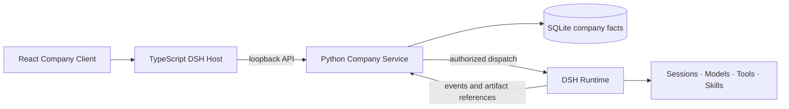

<div align="center">
  <p><strong>English</strong> · <a href="README.zh-CN.md">简体中文</a></p>
  <h1>One Person Company</h1>
  <p><strong>Build, direct, and govern a team of AI employees inside DeepSeek Harness.</strong></p>
  <p>
    
    
    
    <a href="LICENSE"></a>
  </p>
</div>

<p align="center">
  
</p>

One Person Company is an open-source [DeepSeek Harness (DSH)](https://github.com/deepseek-ai/deepseek-harness) plugin for operating a durable, governed company of AI employees. Create role-based employees, talk to the team with `@mentions`, and deliver work through Direct, Star, Graph, or Battle collaboration strategies.

Company owns business facts—workspaces, employee revisions, policy, work graphs, approvals, and artifact references. DSH remains the authority for model execution, sessions, tools, skills, connectors, credentials, and personal memory.

## Quick start

### Requirements

- DSH with the `dsh` CLI on `PATH`
- Node.js 22.19+ and pnpm 11+
- Python 3.13 and [uv](https://docs.astral.sh/uv/)

### Install the plugin

```console
dsh plugin --profile web add github:Ding6666666/one-person-company
```

Then start DSH Web and open **One Person Company** from the plugin surface.

<details>
<summary><strong>Git install note: pnpm build approval</strong></summary>

Git-hosted DSH plugins build through their `prepare` script. pnpm 10+ blocks that script until the profile explicitly allows it. If the first install is blocked, copy the exact package-and-Git-spec key printed by pnpm into that profile's `pnpm-workspace.yaml` under `allowBuilds`, then repeat the command. Review the source and pin a commit for repeatable installation:

```console
dsh plugin --profile web add github:Ding6666666/one-person-company#<commit-sha>
```

</details>

See [Plugin installation](docs/development/plugin-installation.md) for local checkout, update, removal, data, and troubleshooting instructions.

## An AI team with clear roles

Start from a professional role template or define your own employee. Templates provide a role-specific responsibility, system prompt, permission preset, model recommendation, and avatar; every field remains reviewable before creation.

<table>
  <tr>
    <td align="center"><br><strong>Product</strong></td>
    <td align="center"><br><strong>Frontend</strong></td>
    <td align="center"><br><strong>Backend</strong></td>
    <td align="center"><br><strong>Full stack</strong></td>
  </tr>
  <tr>
    <td align="center"><br><strong>Algorithm</strong></td>
    <td align="center"><br><strong>Testing</strong></td>
    <td align="center"><br><strong>Custom</strong></td>
    <td align="center"><strong>Your next role</strong><br><sub>Operations, writing, research, support, or any role you define</sub></td>
  </tr>
</table>

### Understand permissions before granting them

Choose a preset—Observer, Collaborator, Executor, or Manager—then inspect and adjust the individual DSH-backed actions. Selected permissions are visually highlighted, and unsupported runtime capabilities remain unavailable rather than being simulated.


The creation flow also exposes skill and tool references through capability-source interfaces. These are explicit references and import seams; they do not dynamically turn Company catalog entries into DSH runtime capabilities.

## Work where the team talks

Company Chat is the shared command surface for a workspace:

- Type `@` to select one or more active employees and dispatch a focused request.
- See queued, running, completed, and failed employee responses in context.
- Retry failed chat executions without rebuilding the conversation.
- Open work-specific discussions from work cards in the same chat timeline.
- Follow projected work events such as start, approval request, completion, and failure.

Work created in the Work Center is represented in chat, so planning and team communication converge instead of becoming separate silos.

## Four collaboration strategies


| Strategy | How it works | Best for |
|---|---|---|
| **Direct** | One employee owns the objective and delivery end to end. | Clear, self-contained tasks |
| **Star** | A coordinator assigns independent child objectives to parallel contributors. | Parallel work that needs one owner to consolidate it |
| **Graph** | Explicit nodes describe dependencies, delegation, review, and summary relationships. | Multi-stage delivery with real ordering constraints |
| **Battle** | Two to four employees propose independently; a non-participant compares and synthesizes. | Decisions that benefit from competing approaches |

Every work item carries acceptance criteria, immutable graph revisions, bounded attempts, and durable lifecycle events.

## Governance and credentials

- **Four authorization layers:** Workspace, Employee revision, Work Node, and DSH Runtime Profile.
- **Durable approvals:** approval is persisted before dispatch and rechecked against current policy before execution.
- **Bounded delegation:** employees may delegate within the same Workspace through immutable graph revisions.
- **Write-only credentials:** the settings panel stores provider keys through DSH's credential service. Company receives configuration status, not the saved secret value.
- **Safe persistence:** Company stores lifecycle facts and artifact references, not model transcripts, tool arguments, prompts, or final responses.

Creating workspaces and employees is local and does not require a provider credential. A credential is needed only when DSH dispatches model work.

## How it fits into DSH



The repository root is the installable DSH bundle, `@dsh/company-plugin`. The TypeScript Host manages the loopback service lifecycle, the React Client renders authoritative projections, and the Python service owns Company state.

## Repository structure

```text
apps/
  company-service/          Python API, domain, persistence, and orchestration
  dsh-company-plugin/       DSH Host lifecycle and React Client
packages/
  company-plugin-sdk/       Generated public TypeScript SDK
  contracts/                OpenAPI snapshot, provenance, and generators
benchmarks/company/         Safe fixed-set tasks and baseline metrics
docs/                       Product, architecture, and development documentation
evaluation/                 MASEval adapter and fixed evaluation runner
tests/system/               Keyless cross-component acceptance tests
tools/                      Public verification and git-package tooling
vendor/deepseek-harness/    Pinned DSH Git submodule
```

Start with the [documentation index](docs/README.md), [system architecture](docs/architecture/system.md), and [contributing guide](CONTRIBUTING.md).

## Develop from source

```console
git clone --recurse-submodules https://github.com/Ding6666666/one-person-company.git
cd one-person-company
uv sync --all-packages --all-groups
pnpm --dir vendor/deepseek-harness install --frozen-lockfile
pnpm install --frozen-lockfile
```

Run the public keyless verification gate:

```console
uv run python tools/check.py
```

It checks Python quality and types, the pinned DSH build/runtime, system scenarios, evaluation, migrations, OpenAPI contracts, the Host/Client, and the generated SDK. It uses a loopback keyless endpoint and does not require or read a real provider key.

## Configuration and data

The bundle needs no path override. These optional variables exist for local development and controlled deployments:

| Variable | Purpose |
|---|---|
| `DSH_COMPANY_PYTHON` | Use an explicit Python executable instead of the packaged uv launch. |
| `DSH_COMPANY_SERVICE_ROOT` | Use an alternate Company Service directory. |
| `DSH_COMPANY_DATA_ROOT` | Choose the persistent Company data root. |

Never commit `.env` files, databases, WAL/SHM files, session workspaces, logs, profile data, or credentials.

<details>
<summary><strong>Verified DSH limitations</strong></summary>

- The public DSH SDK does not expose cross-process cold Session resume. An attempt found running after restart is recorded as `blocked/runtime_process_lost`; Company does not fabricate Memory or resume semantics.
- A DSH-produced approval control request cannot continue an already-running attempt through the public SDK, so it closes as `approval_control_not_exposed`. Operators decide persisted pre-dispatch approvals through Company APIs or UI.
- Runtime Profiles do not expose `external.publish`; approval cannot create an unavailable runtime capability.
- Company business-plugin actions remain policy and catalog facts. They do not become DSH tools automatically.

See the [DSH capability matrix](docs/development/dsh-capability-matrix.md) and [strategy selection notes](docs/development/strategy-selection.md) for evidence and product consequences.

</details>

## Security and license

Report vulnerabilities through GitHub's [private security advisory form](https://github.com/Ding6666666/one-person-company/security/advisories/new). See [SECURITY.md](SECURITY.md) for the policy.

Licensed under the [Apache License 2.0](LICENSE).
