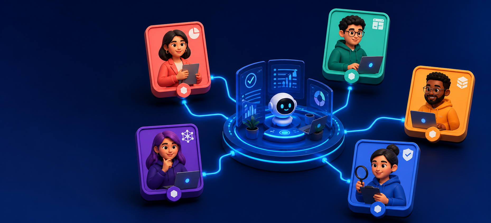
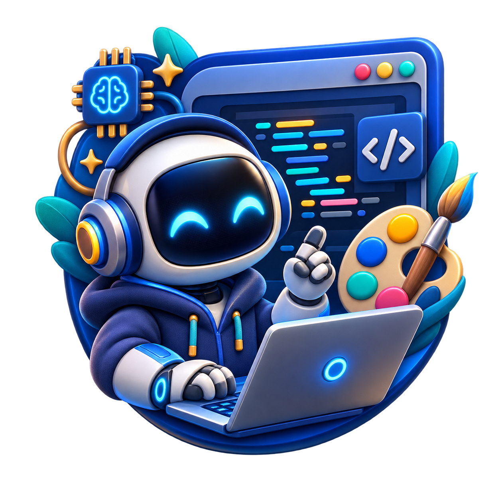
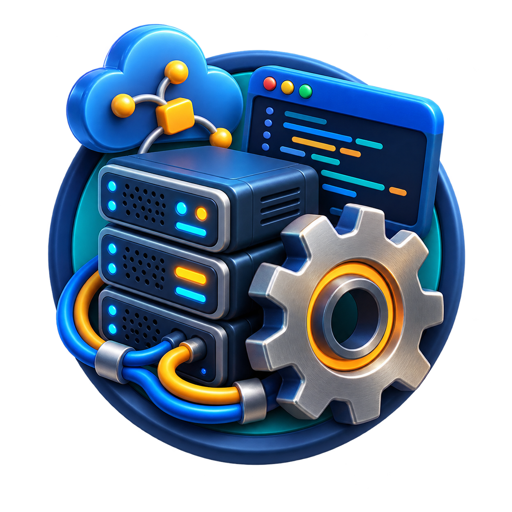
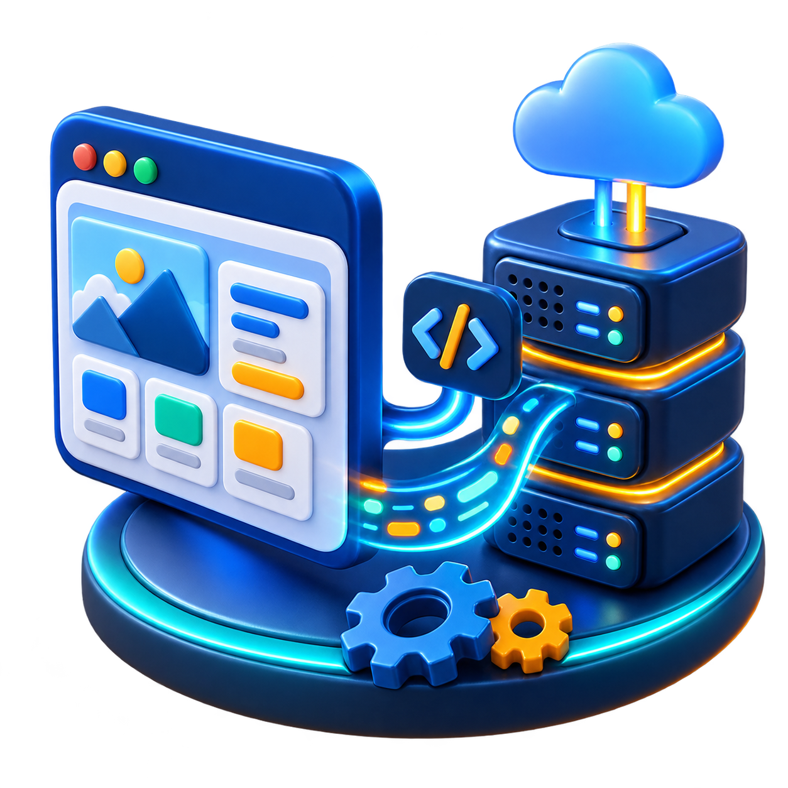
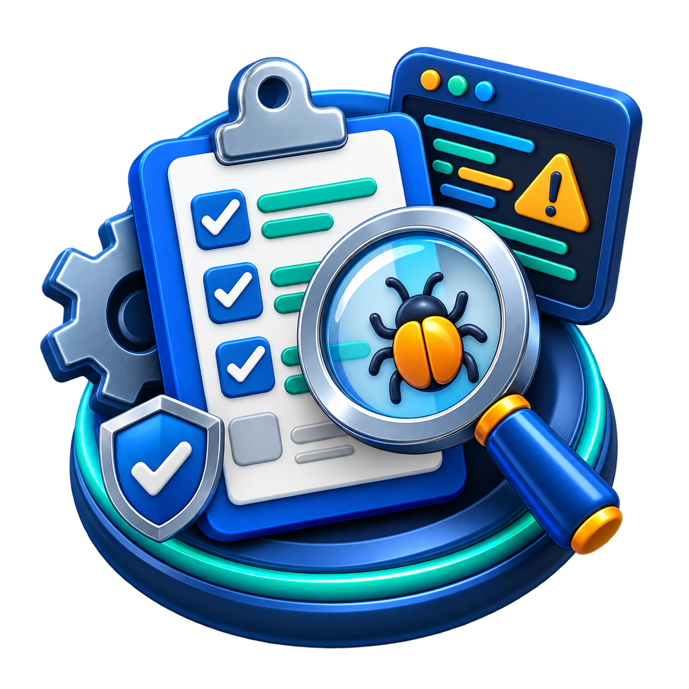
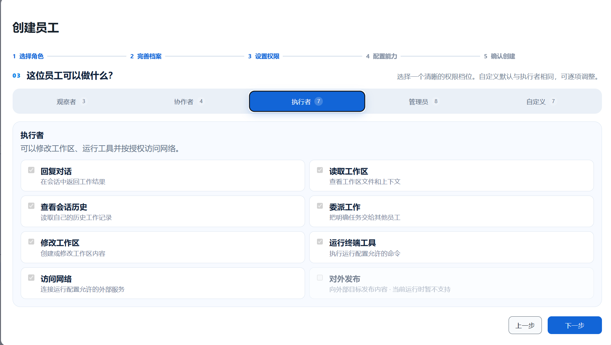
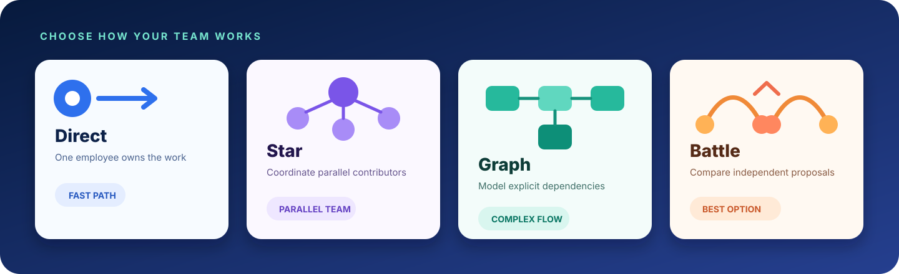
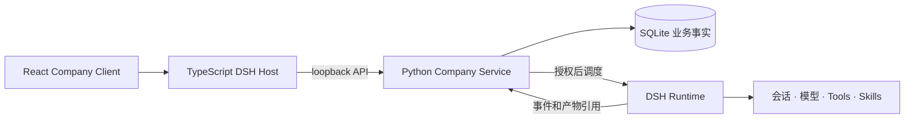

<div align="center">
  <p><a href="README.md">English</a> · <strong>简体中文</strong></p>
  <h1>One Person Company</h1>
  <p><strong>在 DeepSeek Harness 中创建、指挥和治理一支 AI 员工团队。</strong></p>
  <p>
    
    
    
    <a href="LICENSE"></a>
  </p>
</div>

<p align="center">
  
</p>

One Person Company 是一个开源的 [DeepSeek Harness（DSH）](https://github.com/deepseek-ai/deepseek-harness) 插件，用于运行持久、可治理的 AI 员工公司。你可以创建具备专业角色的员工，通过 `@` 在群聊中指挥团队，并使用 Direct、Star、Graph 或 Battle 协作策略完成工作。

Company 负责业务事实，包括工作区、员工版本、策略、工作图、审批和产物引用；模型执行、会话、工具、Skills、连接器、凭据和个人记忆仍由 DSH 管理。

## 快速开始

### 环境要求

- `PATH` 中可使用 DSH 的 `dsh` CLI
- Node.js 22.19+ 和 pnpm 11+
- Python 3.13 和 [uv](https://docs.astral.sh/uv/)

### 安装插件

```console
dsh plugin --profile web add github:Ding6666666/one-person-company
```

随后启动 DSH Web，并从插件界面打开 **One Person Company**。

<details>
<summary><strong>Git 安装说明：允许 pnpm 构建</strong></summary>

Git 托管的 DSH 插件会通过 `prepare` 脚本从源码构建。pnpm 10+ 默认阻止该脚本。如果首次安装被阻止，请把 pnpm 输出的完整“包名和 Git 地址”键复制到对应 profile 的 `pnpm-workspace.yaml`，放在 `allowBuilds` 下，然后重新运行安装命令。请先审阅源码；需要可复现安装时固定提交版本：

```console
dsh plugin --profile web add github:Ding6666666/one-person-company#<commit-sha>
```

</details>

本地检出、更新、卸载、数据管理和排错方式请参阅[插件安装说明](docs/development/plugin-installation.md)。

## 建立职责清晰的 AI 团队

你可以从专业角色模板开始，也可以自定义员工。模板会提供与岗位匹配的职责、System Prompt、权限档位、推荐模型和头像；创建前仍可检查和调整每一个字段。

<table>
  <tr>
    <td align="center"><br><strong>产品经理</strong></td>
    <td align="center"><br><strong>前端工程师</strong></td>
    <td align="center"><br><strong>后端工程师</strong></td>
    <td align="center"><br><strong>全栈工程师</strong></td>
  </tr>
  <tr>
    <td align="center"><br><strong>算法工程师</strong></td>
    <td align="center"><br><strong>测试工程师</strong></td>
    <td align="center"><br><strong>自定义角色</strong></td>
    <td align="center"><strong>你的下一个角色</strong><br><sub>运营、文案、研究、支持，或任何自定义岗位</sub></td>
  </tr>
</table>

### 授权前先理解权限

先选择观察者、协作者、执行者或管理员档位，再查看并调整具体的 DSH 动作。已选择权限会清晰高亮；运行环境不支持的能力不会被模拟成可用状态。



创建流程还通过能力来源接口提供 Skill 和 Tool 引用入口。它们是明确的引用和后续导入接口，不会把 Company 目录项动态变成 DSH 运行能力。

## 在团队沟通的地方工作

公司群聊是工作区内统一的指挥界面：

- 输入 `@` 选择一名或多名活跃员工，并发出明确任务。
- 在上下文中查看排队、运行、完成和失败状态。
- 直接重试失败的群聊执行，不需要重建对话。
- 从工作卡片进入对应任务讨论。
- 跟踪工作开始、请求审批、完成和失败等事件。

工作中心创建的任务会显示在群聊中，让任务规划与团队沟通汇合在同一个流程里。

## 四种协作策略



| 策略 | 工作方式 | 适合场景 |
|---|---|---|
| **Direct** | 一名员工从目标到交付全程负责。 | 边界清晰、能够独立完成的任务 |
| **Star** | 协调者把独立子目标分配给并行员工。 | 可并行拆分、但需要统一收口的工作 |
| **Graph** | 用明确节点表示依赖、委派、审核和汇总关系。 | 存在真实先后约束的多阶段交付 |
| **Battle** | 2–4 名员工独立提出方案，由未参赛员工比较并汇总。 | 需要多个独立观点的决策任务 |

每项工作都包含验收标准、不可变工作图版本、有限尝试次数和持久生命周期事件。

## 治理与凭据

- **四层授权：**工作区、员工版本、工作节点和 DSH Runtime Profile。
- **持久审批：**执行前先持久化审批，真正调度时再次按当前策略检查。
- **有限委派：**员工可以在同一工作区内通过不可变工作图版本进行委派。
- **只写凭据：**设置面板通过 DSH 凭据服务保存模型提供商密钥；Company 只能获得配置状态，不会读取已保存的密钥值。
- **安全持久化：**Company 保存生命周期事实和产物引用，不复制模型对话、工具参数、Prompt 或最终回复。

创建工作区和员工只发生在本地，不需要模型提供商凭据；只有 DSH 真正调度模型工作时才需要凭据。

## 与 DSH 的关系



仓库根目录就是可安装的 DSH bundle：`@dsh/company-plugin`。TypeScript Host 负责 loopback 服务生命周期，React Client 渲染权威投影，Python 服务负责 Company 状态。

## 仓库结构

```text
apps/
  company-service/          Python API、领域、持久化和编排
  dsh-company-plugin/       DSH Host 生命周期和 React Client
packages/
  company-plugin-sdk/       生成的公开 TypeScript SDK
  contracts/                OpenAPI 快照、来源和生成器
benchmarks/company/         安全固定任务集和基线指标
docs/                       产品、架构和开发文档
evaluation/                 MASEval 适配器和固定评测运行器
tests/system/               无密钥跨组件验收测试
tools/                      公开校验和 Git 插件打包工具
vendor/deepseek-harness/    固定版本的 DSH Git 子模块
```

建议从[文档索引](docs/README.md)、[系统架构](docs/architecture/system.md)和[贡献指南](CONTRIBUTING.md)开始阅读。

## 从源码开发

```console
git clone --recurse-submodules https://github.com/Ding6666666/one-person-company.git
cd one-person-company
uv sync --all-packages --all-groups
pnpm --dir vendor/deepseek-harness install --frozen-lockfile
pnpm install --frozen-lockfile
```

运行公开的无密钥检查：

```console
uv run python tools/check.py
```

该检查覆盖 Python 质量与类型、固定版本的 DSH 构建和运行环境、系统场景、评测、迁移、OpenAPI 合约、Host/Client 以及生成的 SDK。它使用 loopback 无密钥端点，不需要也不会读取真实提供商密钥。

## 配置与数据

插件无需路径覆盖即可运行。以下变量仅用于本地开发或受控部署：

| 变量 | 用途 |
|---|---|
| `DSH_COMPANY_PYTHON` | 使用明确的 Python 可执行文件，而不是打包的 uv 启动方式。 |
| `DSH_COMPANY_SERVICE_ROOT` | 使用另一个 Company Service 目录。 |
| `DSH_COMPANY_DATA_ROOT` | 指定持久化 Company 数据目录。 |

不要提交 `.env`、数据库、WAL/SHM 文件、会话工作区、日志、profile 数据或凭据。

<details>
<summary><strong>已确认的 DSH 限制</strong></summary>

- 公开 DSH SDK 不支持跨进程冷恢复 Session。重启后发现仍处于运行状态的尝试会被记录为 `blocked/runtime_process_lost`；Company 不会伪造 Memory 或恢复语义。
- DSH 生成的审批控制请求无法通过公开 SDK 继续已经运行的尝试，因此会以 `approval_control_not_exposed` 关闭。操作员应通过 Company API 或界面处理持久化的执行前审批。
- Runtime Profile 不提供 `external.publish`；审批不能创造运行环境原本不存在的能力。
- Company 业务插件动作仍然只是策略和目录事实，不会自动成为 DSH Tool。

证据和产品影响见 [DSH 能力矩阵](docs/development/dsh-capability-matrix.md)与[策略选择说明](docs/development/strategy-selection.md)。

</details>

## 安全与许可证

请通过 GitHub 的[私有安全公告表单](https://github.com/Ding6666666/one-person-company/security/advisories/new)报告漏洞，安全策略见 [SECURITY.md](SECURITY.md)。

项目采用 [Apache License 2.0](LICENSE)。
